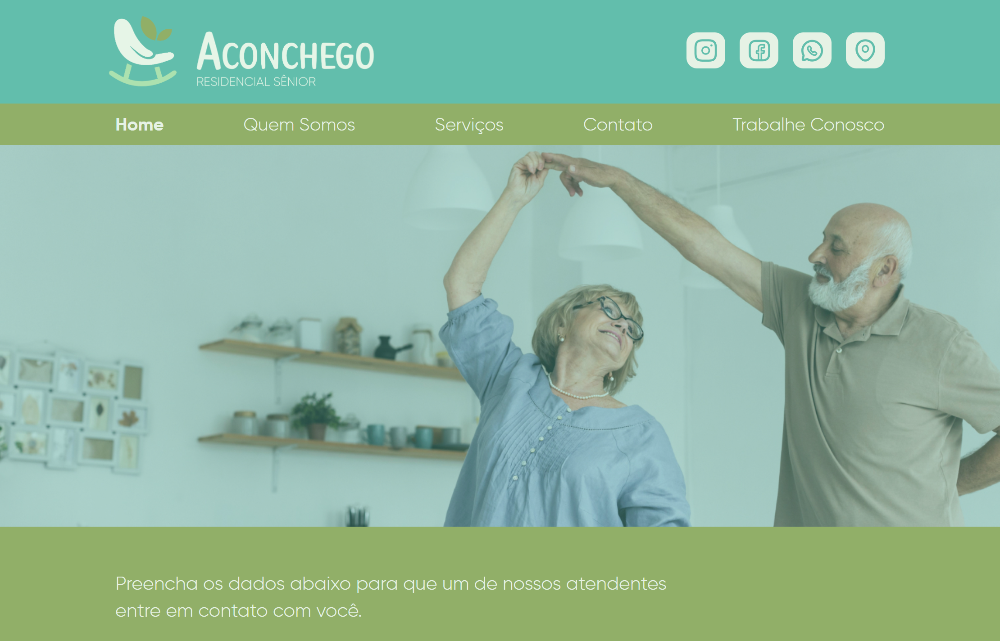

## Welcome! 👋

# Aconchego Residencial Sênior

This is the first page that I've sold for a company ❤️!!! I'm really happy about it, because now I can see that all my effort is paying off! Don't give up guys, your time will come! 💪🍥

### Screen Shots
- Home Page



## Some code that I'm proud of
```js
const btnMobile = document.getElementById('btn-mobile');

function toggleMenu(event) {
    if(event.type === 'touchstart') {
        event.preventDefault()
    }
    const navi = document.getElementById('nav');
    navi.classList.toggle('active')
}

btnMobile.addEventListener('click', toggleMenu);
btnMobile.addEventListener('touchstart', toggleMenu);
```

## Built with

- Semantic HTML5;
- CSS custom properties;
- JavaScript;

## Test the project yourself: [Teste the project here!!!](https://aconchego-residencial-git-main-lucasbailo.vercel.app/)

### You can:

- Fill the form;
- Make contact with the company;
- Navigate between Pages;
- Apply for a job vacancy;
- Go to all social media of the company.

## Author

- Website - [My GitHub](https://github.com/lucasbailo)
- Frontend Mentor - [@lucasbailo](https://www.frontendmentor.io/profile/lucasbailo)
- Instagram - [@lucassbailo](https://www.instagram.com/lucassbailo/)
- LinkedIn - [Lucas Bailo](https://www.linkedin.com/in/lcsbailo)